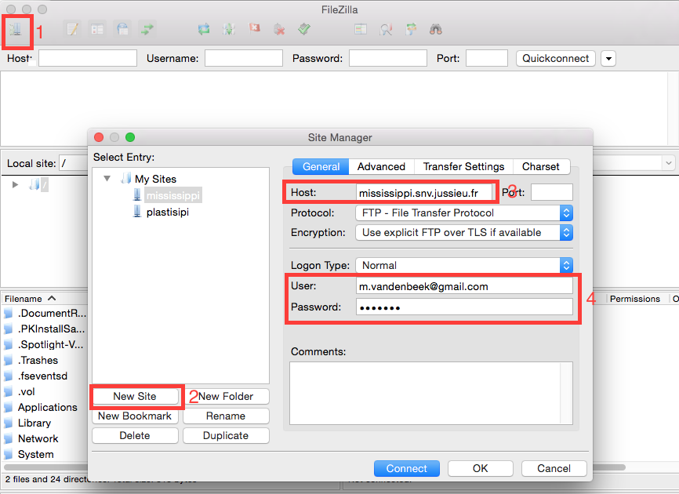
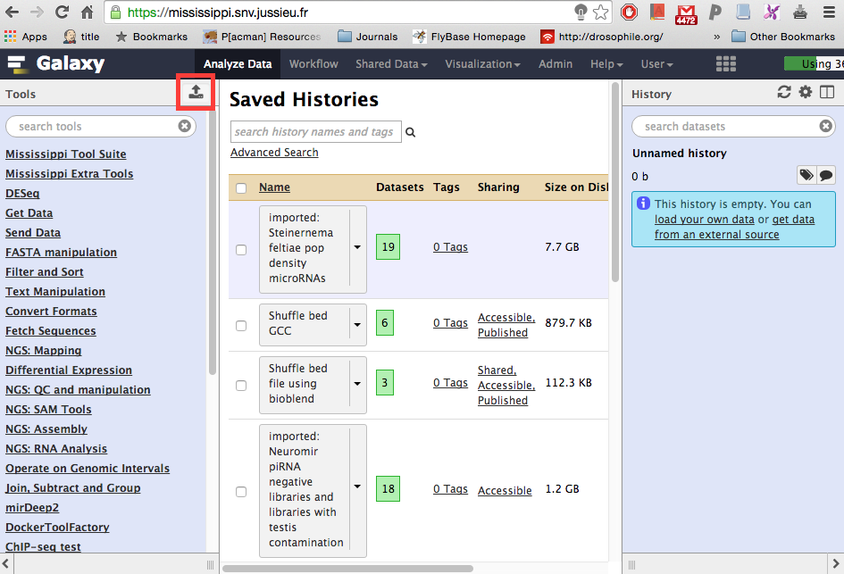
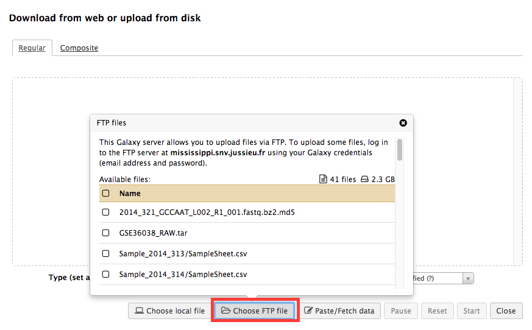

#Uploading large files to the the mississippi.snv.jussieu.fr galaxy server
----

##Short instructions

If you have not registered yet, sign up now.  
To upload data, use any ftp-client and connect using  

hostname: mississippi.snv.jussieu.fr  
user: `<email address used for signing up in galaxy>`  
password: `<your galaxy password>`    
port: `21`    

After the upload has finished, click the upload button in the upper left screen and select `choose FTP file`.  
Choose the files you would like to import to your current galaxy history.  
Click start and your files will appear in your history.

##Long instructions

We recommend [filezilla](https://filezilla-project.org/download.php?type=client) to upload large files to our galaxy servers.
Follow filezilla's install instructions and open filezilla.
  

Click on [1], click on New Site [2] and enter a name. Enter `mississippi.snv.jussieu.fr` in the Host field [3].  
Enter the email address you used for signing up to the mississippi galaxy server and you password in username and 
password [4].

Locate files that you would like to upload in the left panel, and drag them over to the right panel. The transfer will start immediately and might take a while. You can follow the progress bar at the bottom part of filezilla

Next, return to galaxy.

Locate the upload button.

Select `Choose FTP file`, locate the file(s) you would like to use and select them by clicking on the checkbox next
to the filename. Close the popup by clicking on the small close button. Click start and your files will be imported
in your history.

